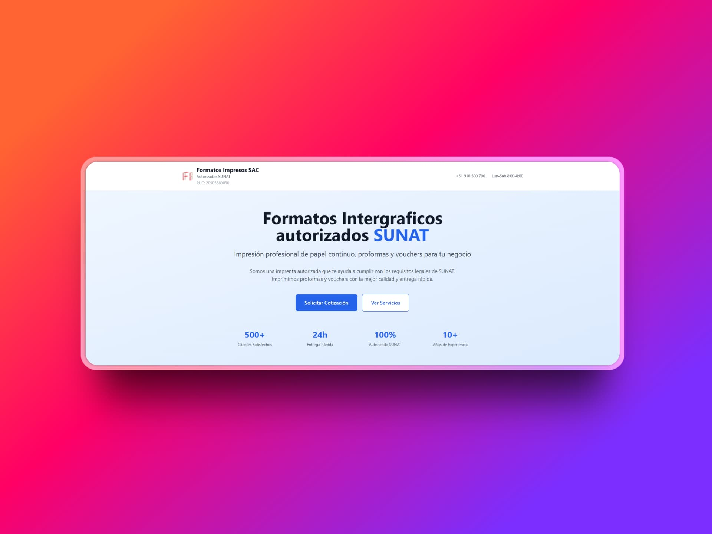

# Landing Page: Formatos Intergraficos (Imprenta Autorizada SUNAT)

> Una landing page moderna, rápida y optimizada para la captación de clientes, desarrollada con Astro.js y TailwindCSS.



## 📄 Descripción del Proyecto

Este proyecto es una landing page diseñada estratégicamente para "Formatos Impresos", una imprenta peruana autorizada por la SUNAT. El objetivo principal del sitio es presentar los servicios de impresión de manera clara y profesional, generar confianza en los clientes potenciales y facilitar la solicitud de cotizaciones a través de un formulario de contacto optimizado.

La página está construida siguiendo las mejores prácticas de desarrollo web, enfocándose en la velocidad de carga, la optimización para motores de búsqueda (SEO) y una experiencia de usuario fluida en cualquier dispositivo (diseño responsivo).

## ✨ Características Principales

*   **Diseño Moderno y Responsivo:** Interfaz limpia y profesional que se adapta perfectamente a ordenadores de escritorio, tabletas y móviles.
*   **Optimizada para la Velocidad:** Construida con Astro.js para un rendimiento máximo, lo que se traduce en tiempos de carga casi instantáneos.
*   **Enfoque en la Conversión:** Todas las secciones están diseñadas para guiar al usuario hacia la acción principal: solicitar una cotización.
*   **Formulario de Cotización Inteligente:**
    *   **Integración con WhatsApp:** Al enviar el formulario, se genera un mensaje pre-formateado y se abre WhatsApp para que el cliente envíe la cotización directamente al número de la empresa.
    *   **Asistente de Consulta RUC:** Un botón que redirige a la página oficial de consulta de SUNAT para facilitar la verificación de datos.
*   **Componentes Reutilizables:** La estructura del proyecto está basada en componentes modulares de Astro, lo que facilita su mantenimiento y escalabilidad.
*   **Sección de FAQ Interactiva:** Un acordeón de preguntas frecuentes para resolver las dudas más comunes de los clientes de forma rápida y eficiente.

## 🛠️ Tecnologías Utilizadas

*   **Framework:** [Astro.js](https://astro.build/)
*   **Estilos:** [TailwindCSS](https://tailwindcss.com/)
*   **Lenguaje:** HTML, CSS, y TypeScript (para scripting)
*   **Gestor de Paquetes:** npm
*   **Despliegue Recomendado:** Vercel, Netlify, o cualquier hosting de sitios estáticos.

## 🚀 Cómo Empezar

Si deseas ejecutar este proyecto en tu entorno local, sigue estos sencillos pasos:

1.  **Clona el repositorio:**
    ```bash
    git clone <URL_DEL_REPOSITORIO>
    ```

2.  **Navega al directorio del proyecto:**
    ```bash
    cd formatos-intergraficos
    ```

3.  **Instala las dependencias:**
    ```bash
    npm install
    ```

4.  **Inicia el servidor de desarrollo:**
    ```bash
    npm run dev
    ```

    ¡Y listo! La página estará disponible en `http://localhost:4321`.
